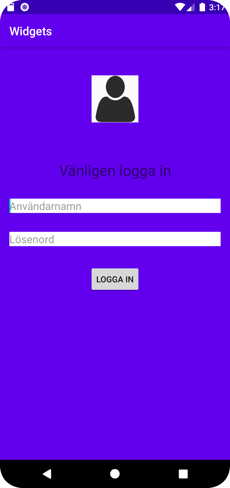

# Rapport

**Skriv din rapport här!**

Denna uppgiften gick ut på att skapa en layout och lägga till minst 3 views inuti layouten. I mitt fall valdes en LinearLayout och sedan lades
i toppen en ImageView till, som representerar en tom inloggingsprofil. Undertill lades en TextView till med texten "Vänligen logga in". Under denna
lades två EditText till som representerar inputrutor för användarnamn och lösenord. Längst ner lades även en Button till som representerar
inloggningsknapp.

Bildens storlek hårdkodades till 80x80dp.
Övriga elements width sattes till match_parent och kontrollerades sedan via margin till Start och End. Heighten sattes till wrap_content.
I inputboxarna användes "hint" för att texten sedan ska försvinna när man börjar skriva.

Margin användes mellan elementen för att positionera dem.

LinearLayouten använde sig utav en centrerad gravity och en vertical orientation.

```
 <LinearLayout
        android:layout_height="match_parent"
        android:layout_width="match_parent"
        android:id="@+id/parentLayout"
        android:background="@color/colorPrimary"
        android:orientation="vertical"
        android:gravity="center_horizontal"
        tools:ignore="MissingConstraints">

        <ImageView
            android:src="@drawable/login"
            android:layout_width="80dp"
            android:layout_height="80dp"
            android:layout_marginTop="48dp"
            android:contentDescription="@string/todo"
            />

        <TextView
            android:layout_width="match_parent"
            android:layout_height="wrap_content"
            android:layout_marginTop="64dp"
            android:textSize="25sp"
            android:text="@string/loginText"
            android:gravity="center"/>

        <EditText
            android:layout_width="match_parent"
            android:layout_height="wrap_content"
            android:layout_marginTop="32dp"
            android:layout_marginStart="16dp"
            android:layout_marginEnd="16dp"
            android:background="@color/white"
            android:hint="@string/username"/>

        <EditText
            android:layout_width="match_parent"
            android:layout_height="wrap_content"
            android:layout_marginTop="32dp"
            android:layout_marginStart="16dp"
            android:layout_marginEnd="16dp"
            android:background="@color/white"
            android:hint="@string/password"/>

        <Button
            android:layout_width="wrap_content"
            android:layout_height="wrap_content"
            android:layout_marginTop="32dp"
            android:text="@string/loginButton"
            />

    </LinearLayout>
```



